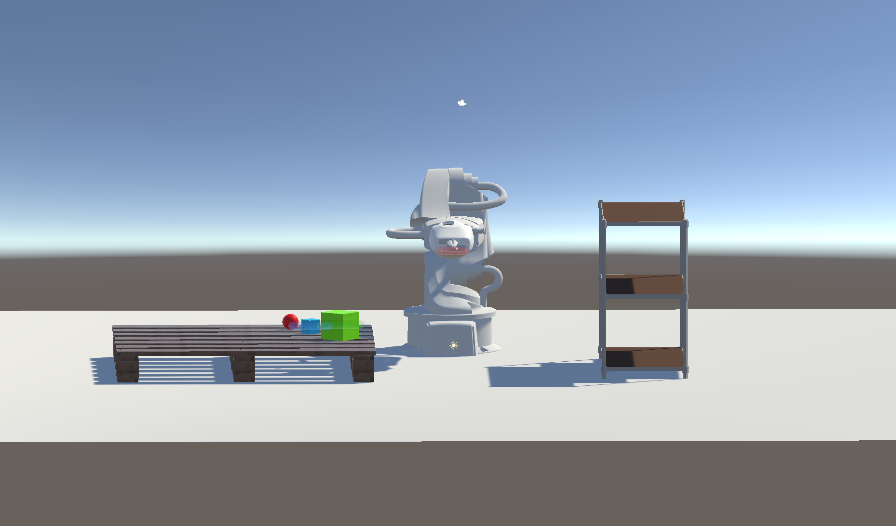
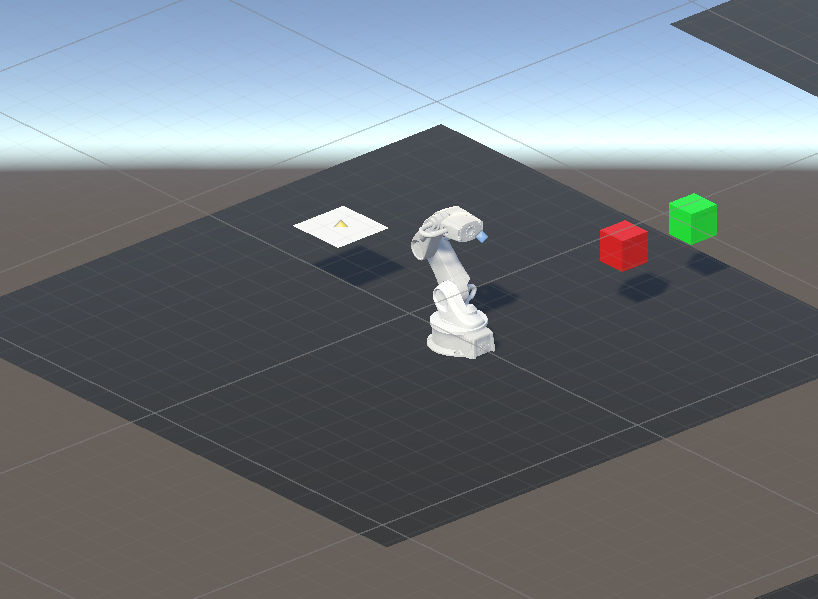
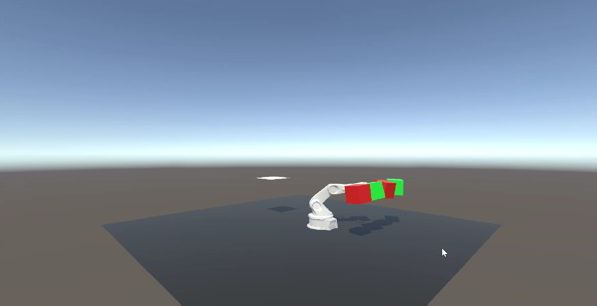

# Robot-sorting-with-Digital-Twin-and-Deep-Reinforcement-Learning

A Unity simulation of a robotic sorting system that combines digital twin technology with deep reinforcement learning, enabling a robot arm to pick and place colored cubes using real-time feedback and continuous torque control. AY2024/2025 FYP project.

## Sample Scenes
### Digital Twin Scene  

### DRL Training Scene  

### DRL Testing Scene  

